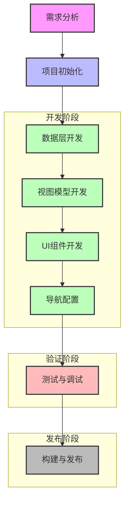
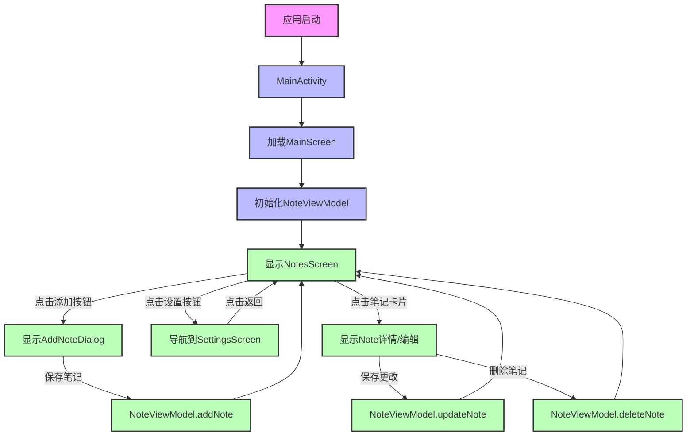

# Journey - 笔记应用

一个基于Android Jetpack Compose开发的现代化笔记应用，提供简洁、流畅的用户体验。

## 功能特性

- ✅ 创建、编辑和删除笔记
- ✅ 笔记列表展示
- ✅ 简洁直观的用户界面
- ✅ 支持深色/浅色主题
- ✅ 导航功能（笔记列表 ↔ 设置）
- ✅ 响应式设计

## 技术栈

| 技术 | 版本 | 用途 |
|------|------|------|
| Kotlin | 1.9.x | 主要开发语言 |
| Jetpack Compose | 1.5.x | UI框架 |
| ViewModel | 2.7.x | 状态管理 |
| Navigation Compose | 2.7.x | 页面导航 |
| Material3 | 1.2.x | UI组件库 |

## 项目结构

```
app/src/main/java/com/example/journey/
├── MainActivity.kt          # 应用入口，设置导航和主题
├── data/
│   └── Note.kt             # 笔记数据模型
├── ui/
│   ├── component/          # 可复用UI组件
│   │   ├── AddNoteDialog.kt  # 添加/编辑笔记对话框
│   │   └── NoteCard.kt       # 笔记卡片组件
│   ├── screen/             # 页面组件
│   │   ├── NotesScreen.kt    # 笔记列表页面
│   │   └── SettingsScreen.kt # 设置页面
│   └── theme/              # 主题配置
│       ├── Color.kt         # 颜色定义
│       ├── Theme.kt         # 主题样式
│       └── Type.kt          # 字体样式
└── viewmodel/
    └── NoteViewModel.kt     # 笔记状态管理
```

## 开发流程

### 1. 需求分析
- 确定应用功能和核心特性
- 设计用户界面和交互流程
- 定义数据模型和状态管理方案

### 2. 项目初始化
- 创建Android项目
- 配置Jetpack Compose和相关依赖
- 设置项目目录结构

### 3. 数据层开发
- 定义数据模型（如Note.kt）
- 实现数据存储和管理逻辑

### 4. 视图模型开发
- 创建ViewModel类
- 实现状态管理和业务逻辑
- 定义与UI交互的接口

### 5. UI组件开发
- 开发可复用组件
- 实现页面布局和样式
- 添加交互逻辑

### 6. 导航配置
- 设置导航路由
- 实现页面间跳转
- 处理导航参数

### 7. 测试与调试
- 单元测试
- UI测试
- 性能优化

### 8. 构建与发布
- 生成签名APK
- 发布到应用商店

## 开发流程图



## 应用流程图



## 如何运行

### 环境要求
- Android Studio Hedgehog (2023.1.1) 或更高版本
- Android SDK 34 或更高版本
- Kotlin 1.9.0 或更高版本

### 运行步骤

1. 克隆项目到本地
2. 使用Android Studio打开项目
3. 等待Gradle同步完成
4. 连接Android设备或启动模拟器
5. 点击运行按钮（绿色三角形）

## 贡献指南

欢迎贡献代码！请按照以下步骤进行：

1. Fork 本仓库
2. 创建特性分支 (`git checkout -b feature/AmazingFeature`)
3. 提交更改 (`git commit -m 'Add some AmazingFeature'`)
4. 推送到分支 (`git push origin feature/AmazingFeature`)
5. 打开 Pull Request


---

感谢使用 Journey 笔记应用！