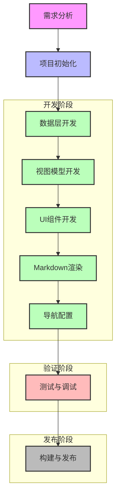
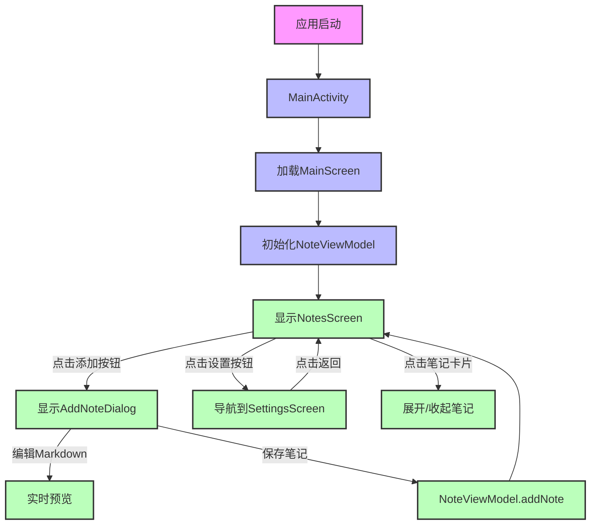

# Journey - 笔记应用

一个基于 Android Jetpack Compose 开发的现代化笔记应用，提供简洁、流畅的用户体验，支持完整的 Markdown 渲染。

## 功能特性

- ✅ 创建、编辑和删除笔记
- ✅ 笔记列表展示
- ✅ **完整的 Markdown 渲染支持**
- ✅ 实时 Markdown 预览编辑
- ✅ 标签管理
- ✅ 简洁直观的用户界面
- ✅ 支持深色/浅色主题
- ✅ 导航功能（笔记列表 ↔ 设置）
- ✅ 响应式设计

### Markdown 支持

应用支持完整的 Markdown 语法：

| 语法 | 示例 | 说明 |
|------|------|------|
| 标题 | `# H1` `## H2` | 支持 1-6 级标题 |
| 加粗 | `**text**` | 粗体文本 |
| 斜体 | `*text*` | 斜体文本 |
| 删除线 | `~~text~~` | 删除线样式 |
| 高亮 | `==text==` | 黄色高亮背景 |
| 行内代码 | `` `code` `` | 等宽字体代码 |
| 代码块 | ` ```code``` ` | 带背景的代码块 |
| 引用块 | `> text` | 左侧带蓝色边框 |
| 无序列表 | `- item` | 圆点列表 |
| 有序列表 | `1. item` | 数字列表 |
| 链接 | `[text](url)` | 可点击链接 |
| 分隔线 | `---` | 水平分割线 |
| 表格 | `\| col \| col \|` | 数据表格 |

## 技术栈

| 技术 | 版本 | 用途 |
|------|------|------|
| Kotlin | 1.9.x | 主要开发语言 |
| Jetpack Compose | 1.5.x | UI 框架 |
| ViewModel | 2.7.x | 状态管理 |
| Navigation Compose | 2.7.x | 页面导航 |
| Material3 | 1.2.x | UI 组件库 |

## 项目结构

```
app/src/main/java/com/example/journey/
├── MainActivity.kt          # 应用入口，设置导航和主题
├── data/
│   └── Note.kt             # 笔记数据模型
├── ui/
│   ├── component/          # 可复用 UI 组件
│   │   ├── AddNoteDialog.kt  # 添加/编辑笔记对话框（含 Markdown 编辑工具栏）
│   │   ├── NoteCard.kt       # 笔记卡片组件（含 Markdown 渲染）
│   │   ├── MarkdownRenderer.kt   # Markdown 渲染器
│   │   └── MarkdownText.kt       # Markdown 文本组件
│   ├── screen/             # 页面组件
│   │   ├── NotesScreen.kt    # 笔记列表页面
│   │   └── SettingsScreen.kt # 设置页面
│   └── theme/              # 主题配置
│       ├── Color.kt         # 颜色定义（含 Markdown 主题色）
│       ├── Theme.kt         # 主题样式
│       └── Type.kt          # 字体样式
└── viewmodel/
    └── NoteViewModel.kt     # 笔记状态管理
```

## Markdown 编辑器功能

### 编辑界面

- **双模式切换**：编辑模式和预览模式一键切换
- **快捷工具栏**：提供常用 Markdown 语法的快捷按钮
  - 格式：加粗、斜体、删除线、高亮
  - 代码：行内代码、代码块
  - 列表：无序列表、有序列表
  - 结构：标题、引用、链接
- **标签补全**：输入 `#` 自动提示可用标签
- **实时预览**：即时查看 Markdown 渲染效果

### 渲染效果

- **自适应主题**：支持深色/浅色模式切换
- **代码高亮**：代码块显示语言标签
- **表格样式**：交替行背景色，清晰的边框
- **引用样式**：左侧蓝色边框，斜体字

## 开发流程

### 1. 需求分析
- 确定应用功能和核心特性
- 设计用户界面和交互流程
- 定义数据模型和状态管理方案

### 2. 项目初始化
- 创建 Android 项目
- 配置 Jetpack Compose 和相关依赖
- 设置项目目录结构

### 3. 数据层开发
- 定义数据模型（如 Note.kt）
- 实现数据存储和管理逻辑

### 4. 视图模型开发
- 创建 ViewModel 类
- 实现状态管理和业务逻辑
- 定义与 UI 交互的接口

### 5. UI 组件开发
- 开发可复用组件
- 实现页面布局和样式
- 添加交互逻辑

### 6. Markdown 渲染功能
- 实现 Markdown 解析器
- 创建 Composable 渲染组件
- 支持主题适配

### 7. 导航配置
- 设置导航路由
- 实现页面间跳转
- 处理导航参数

### 8. 测试与调试
- 单元测试
- UI 测试
- 性能优化

### 9. 构建与发布
- 生成签名 APK
- 发布到应用商店

## 开发流程图


```mermaid
flowchart TD
    A[需求分析] --> B[项目初始化]
    B --> C[数据层开发]
    C --> D[视图模型开发]
    D --> E[UI组件开发]
    E --> F[Markdown渲染]
    F --> G[导航配置]
    G --> H[测试与调试]
    H --> I[构建与发布]
    
    subgraph 开发阶段
        C
        D
        E
        F
        G
    end
    
    subgraph 验证阶段
        H
    end
    
    subgraph 发布阶段
        I
    end
    
    style A fill:#f9f,stroke:#333,stroke-width:2px
    style B fill:#bbf,stroke:#333,stroke-width:2px
    style C fill:#bfb,stroke:#333,stroke-width:2px
    style D fill:#bfb,stroke:#333,stroke-width:2px
    style E fill:#bfb,stroke:#333,stroke-width:2px
    style F fill:#bfb,stroke:#333,stroke-width:2px
    style G fill:#bfb,stroke:#333,stroke-width:2px
    style H fill:#fbb,stroke:#333,stroke-width:2px
    style I fill:#bbb,stroke:#333,stroke-width:2px
```

## 应用流程图


```mermaid
flowchart TD
    A[应用启动] --> B[MainActivity]
    B --> C[加载MainScreen]
    C --> D[初始化NoteViewModel]
    D --> E[显示NotesScreen]
    
    E -->|点击添加按钮| F[显示AddNoteDialog]
    F -->|编辑Markdown| F1[实时预览]
    F -->|保存笔记| G[NoteViewModel.addNote]
    G --> E
    
    E -->|点击设置按钮| H[导航到SettingsScreen]
    H -->|点击返回| E
    
    E -->|点击笔记卡片| I[展开/收起笔记]
    
    style A fill:#f9f,stroke:#333,stroke-width:2px
    style B fill:#bbf,stroke:#333,stroke-width:2px
    style C fill:#bbf,stroke:#333,stroke-width:2px
    style D fill:#bbf,stroke:#333,stroke-width:2px
    style E fill:#bfb,stroke:#333,stroke-width:2px
    style F fill:#bfb,stroke:#333,stroke-width:2px
    style F1 fill:#bfb,stroke:#333,stroke-width:2px
    style G fill:#bfb,stroke:#333,stroke-width:2px
    style H fill:#bfb,stroke:#333,stroke-width:2px
    style I fill:#bfb,stroke:#333,stroke-width:2px
```

## 如何运行

### 环境要求
- Android Studio Hedgehog (2023.1.1) 或更高版本
- Android SDK 34 或更高版本
- Kotlin 1.9.0 或更高版本

### 运行步骤

1. 克隆项目到本地
2. 使用 Android Studio 打开项目
3. 等待 Gradle 同步完成
4. 连接 Android 设备或启动模拟器
5. 点击运行按钮（绿色三角形）

## 贡献指南

欢迎贡献代码！请按照以下步骤进行：

1. Fork 本仓库
2. 创建特性分支 (`git checkout -b feature/AmazingFeature`)
3. 提交更改 (`git commit -m 'Add some AmazingFeature'`)
4. 推送到分支 (`git push origin feature/AmazingFeature`)
5. 打开 Pull Request

---

感谢使用 Journey 笔记应用！
