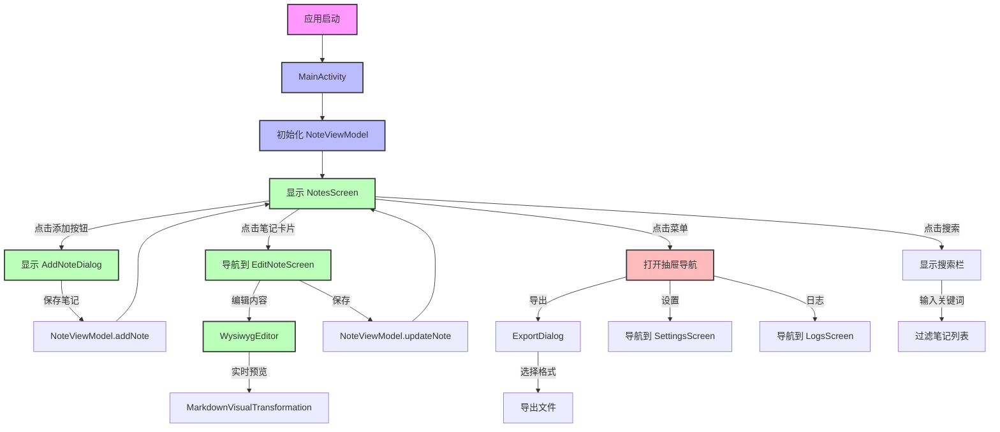

# Journey - 笔记应用

一个基于 Android Jetpack Compose 开发的现代化笔记应用，提供简洁、流畅的用户体验，支持所见即所得的 Markdown 编辑和完整的 Markdown 渲染。

## 功能特性

- ✅ 创建、编辑和删除笔记
- ✅ 笔记列表展示，支持卡片式布局
- ✅ **所见即所得 (WYSIWYG) Markdown 编辑器**
- ✅ **完整的 Markdown 渲染支持**
- ✅ 标签管理（支持 `#标签名` 语法）
- ✅ 标签自动补全功能
- ✅ 笔记搜索功能
- ✅ 笔记导出功能（支持 Markdown/JSON/TXT 格式）
- ✅ 简洁直观的用户界面
- ✅ 支持深色/浅色主题
- ✅ 导航功能（笔记列表 ↔ 编辑页面 ↔ 设置 ↔ 日志）
- ✅ 抽屉式侧边栏导航
- ✅ 响应式设计
- ✅ 操作音效反馈

### Markdown 支持

应用支持完整的 Markdown 语法：

| 语法 | 示例 | 说明 |
|------|------|------|
| 标题 | `# H1` `## H2` | 支持 1-6 级标题 |
| 加粗 | `**text**` `__text__` | 粗体文本 |
| 斜体 | `*text*` `_text_` | 斜体文本 |
| 删除线 | `~~text~~` | 删除线样式 |
| 高亮 | `==text==` | 黄色高亮背景 |
| 下划线 | `<u>text</u>` | 下划线样式 |
| 链接 | `[text](url)` | 可点击链接 |
| 无序列表 | `- item` `* item` | 圆点列表 |
| 有序列表 | `1. item` | 数字列表 |
| 标签 | `#标签名` | 支持中英文标签 |

## 技术栈

| 技术 | 版本 | 用途 |
|------|------|------|
| Kotlin | 1.9.x | 主要开发语言 |
| Jetpack Compose | 1.5.x | UI 框架 |
| ViewModel | 2.7.x | 状态管理 |
| Navigation Compose | 2.7.x | 页面导航 |
| Material3 | 1.2.x | UI 组件库 |
| Gson | 2.10.x | JSON 序列化 |

## 项目结构

```
app/src/main/java/com/example/journey/
├── MainActivity.kt              # 应用入口，设置导航和主题
├── data/
│   ├── Note.kt                  # 笔记数据模型
│   └── NoteRepository.kt        # 笔记数据仓库
├── ui/
│   ├── component/               # 可复用 UI 组件
│   │   ├── AddNoteDialog.kt     # 添加笔记对话框
│   │   ├── NoteCard.kt          # 笔记卡片组件
│   │   ├── MarkdownParser.kt    # Markdown 解析器
│   │   ├── MarkdownRenderer.kt  # Markdown 渲染器
│   │   ├── RenderedMarkdownText.kt  # Markdown 文本渲染
│   │   ├── MarkdownVisualTransformation.kt  # Markdown 视觉转换
│   │   ├── MarkdownToolbar.kt   # Markdown 工具栏
│   │   ├── WysiwygEditor.kt     # 所见即所得编辑器
│   │   ├── WysiwygEditorState.kt  # 编辑器状态管理
│   │   └── WysiwygPreview.kt    # 编辑器预览
│   ├── screen/                  # 页面组件
│   │   ├── NotesScreen.kt       # 笔记列表页面（含搜索、导出）
│   │   ├── EditNoteScreen.kt    # 笔记编辑页面
│   │   ├── SettingsScreen.kt    # 设置页面
│   │   └── LogsScreen.kt        # 日志页面
│   └── theme/                   # 主题配置
│       ├── Color.kt             # 颜色定义
│       ├── Theme.kt             # 主题样式
│       └── Type.kt              # 字体样式
├── utils/
│   └── AppSoundPlayer.kt        # 应用音效播放器
└── viewmodel/
    └── NoteViewModel.kt         # 笔记状态管理
```

## 核心功能详解

### 1. 所见即所得编辑器 (WYSIWYG Editor)

- **实时渲染**：在编辑时即时显示 Markdown 格式效果
- **快捷工具栏**：提供常用 Markdown 语法的快捷按钮
  - 格式：加粗、斜体、删除线、高亮、下划线
  - 结构：标题、无序列表、有序列表
  - 链接：快速插入链接
- **标签补全**：输入 `#` 自动提示可用标签，支持智能定位
- **视觉转换**：使用 `MarkdownVisualTransformation` 实现编辑时的样式渲染

### 2. Markdown 解析与渲染

- **解析器**：`MarkdownParserImpl` 支持块级元素和行内标记
- **块级元素**：段落、标题（1-6级）、无序列表、有序列表、空行
- **行内标记**：加粗、斜体、删除线、高亮、下划线、链接、标签
- **渲染器**：`MarkdownRenderer` 将解析结果渲染为 Compose UI

### 3. 笔记管理

- **CRUD 操作**：创建、读取、更新、删除笔记
- **标签系统**：支持多标签管理，可在编辑器中通过 `#标签名` 添加
- **搜索功能**：支持按内容实时搜索笔记
- **时间戳**：自动记录创建和修改时间

### 4. 导出功能

支持三种导出格式：
- **Markdown (.md)**：保留 Markdown 格式和标签信息
- **JSON (.json)**：包含完整数据的结构化导出
- **纯文本 (.txt)**：简洁易读的文本格式

### 5. 导航与界面

- **抽屉式导航**：左侧滑出菜单，包含导出、设置、日志入口
- **页面导航**：
  - 笔记列表 → 编辑页面
  - 笔记列表 → 设置页面
  - 笔记列表 → 日志页面
- **悬浮按钮**：居中显示的添加笔记按钮

## 开发流程

### 1. 需求分析
- 确定应用功能和核心特性
- 设计用户界面和交互流程
- 定义数据模型和状态管理方案

### 2. 项目初始化
- 创建 Android 项目
- 配置 Jetpack Compose 和相关依赖
- 设置项目目录结构

### 3. 数据层开发
- 定义数据模型（Note.kt）
- 实现数据存储和管理逻辑（NoteRepository.kt）

### 4. 视图模型开发
- 创建 ViewModel 类
- 实现状态管理和业务逻辑
- 定义与 UI 交互的接口

### 5. UI 组件开发
- 开发可复用组件
- 实现页面布局和样式
- 添加交互逻辑

### 6. Markdown 编辑器功能
- 实现 Markdown 解析器
- 创建所见即所得编辑器
- 实现视觉转换和实时预览

### 7. 导航配置
- 设置导航路由
- 实现页面间跳转
- 处理导航参数

### 8. 测试与调试
- 单元测试
- UI 测试
- 性能优化

### 9. 构建与发布
- 生成签名 APK
- 发布到应用商店

## 应用流程图


```mermaid
flowchart TD
    A[应用启动] --> B[MainActivity]
    B --> C[初始化 NoteViewModel]
    C --> D[显示 NotesScreen]
    
    D -->|点击添加按钮| E[显示 AddNoteDialog]
    E -->|保存笔记| F[NoteViewModel.addNote]
    F --> D
    
    D -->|点击笔记卡片| G[导航到 EditNoteScreen]
    G -->|编辑内容| H[WysiwygEditor]
    H -->|实时预览| I[MarkdownVisualTransformation]
    G -->|保存| J[NoteViewModel.updateNote]
    J --> D
    
    D -->|点击菜单| K[打开抽屉导航]
    K -->|导出| L[ExportDialog]
    L -->|选择格式| M[导出文件]
    K -->|设置| N[导航到 SettingsScreen]
    K -->|日志| O[导航到 LogsScreen]
    
    D -->|点击搜索| P[显示搜索栏]
    P -->|输入关键词| Q[过滤笔记列表]
    
    style A fill:#f9f,stroke:#333,stroke-width:2px
    style B fill:#bbf,stroke:#333,stroke-width:2px
    style C fill:#bbf,stroke:#333,stroke-width:2px
    style D fill:#bfb,stroke:#333,stroke-width:2px
    style E fill:#bfb,stroke:#333,stroke-width:2px
    style G fill:#bfb,stroke:#333,stroke-width:2px
    style H fill:#bfb,stroke:#333,stroke-width:2px
    style K fill:#fbb,stroke:#333,stroke-width:2px
```

## 如何运行

### 环境要求
- Android Studio Hedgehog (2023.1.1) 或更高版本
- Android SDK 34 或更高版本
- Kotlin 1.9.0 或更高版本

### 运行步骤

1. 克隆项目到本地
2. 使用 Android Studio 打开项目
3. 等待 Gradle 同步完成
4. 连接 Android 设备或启动模拟器
5. 点击运行按钮（绿色三角形）

## 贡献指南

欢迎贡献代码！请按照以下步骤进行：

1. Fork 本仓库
2. 创建特性分支 (`git checkout -b feature/AmazingFeature`)
3. 提交更改 (`git commit -m 'Add some AmazingFeature'`)
4. 推送到分支 (`git push origin feature/AmazingFeature`)
5. 打开 Pull Request

---

感谢使用 Journey 笔记应用！
